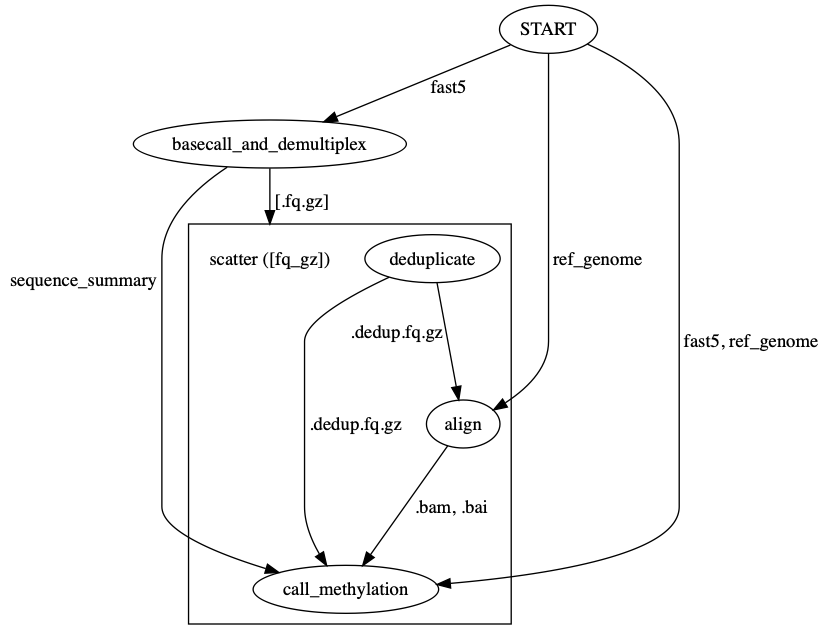

# Oxford nanopore tools

## Installing dependencies

- Install Homebrew

https://brew.sh

- Install cromwell

```
brew install cromwell
```

- Install Docker

https://hub.docker.com/editions/community/docker-ce-desktop-mac

## Getting started

### Quick Start

```
cromwell run -i test_data/test-run-1.json preprocess_flowcell.wdl 
```


### Testing within a docker image

e.g.
```
docker run --rm -it aryeelab/nanopore_albacore
```

## Visualizing the workflow graph

You can use `womtool` (part of cromwell) to output a workflow graph in `.dot` format:

```
womtool graph preprocess_flowcell.wdl > preprocess_flowcell.dot
```

This graph can be edited if necessary (such as to label edges with inputs/outputs), and then visualized with graphviz (`brew install graphviz`):

```
dot preprocess_flowcell.dot -Tpng -o preprocess_flowcell.png
```

The workflow graph below is produced in this way.


## Preprocess Flowcell workflow



